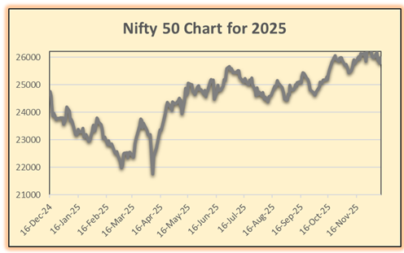

# NIFTY 50 Stock Market Analysis (Excel Project)

## 📊 Project Overview
This project analyzes NIFTY 50 stock market data using Microsoft Excel.
The dataset includes Open, High, Low, Close, Volume, and Turnover values.

## 🎯 Objectives
- Analyze price trends
- Study daily market movements
- Identify volatility patterns
- Understand trading volume impact

## 🛠 Tools Used
- Microsoft Excel
- Data Cleaning
- Data Visualization (Charts)
- Basic Financial Analysis

## 📈 Key Insights
- Observed market trend fluctuations
- Identified volatility in price movements
- Analyzed trading volume and turnover patterns
  
 ## 📊 NIFTY 50 Closing Price Trend (2025)

## 🚀 Skills Demonstrated
- Data Analysis
- Financial Data Interpretation
- Excel Functions & Charts
- Trend Analysis
- 
👤 Author: Tushar Tyagi

